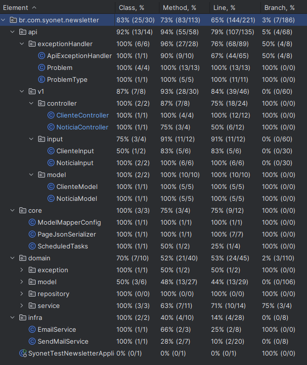

# Getting Started

#### Descrição

Criação de um sistema que:

- [ ] Cadastro de clientes
- [ ]   Cadastro de noticias
- [ ]  O sistema deve consultar os registros todos os dias às 08h e disparar e-mails
  para os clientes
- [ ] E-mails devem incluir notícias cadastradas e não processadas;
- [ ]  Se a data de nascimento de um cliente coincidir com a data atual, incluir uma
  mensagem de "Feliz Aniversário" no e-mail

### Start e observações

 * Necessario ter o docker instalado
 * Compose será inicializado automaticamente
 * Para testes recomendo iniciar atravez do comando `docker-compose up` na pasta raiz.
 * O email deve ser configurado para funcionar corretamente. Dia 9/08/2024 removerei a chave cadastrada como default

 * url do swagger = /swagger-ui/index.html

### Documentação de Referencia

For further reference, please consider the following sections:

* [Official Apache Maven documentation](https://maven.apache.org/guides/index.html)
* [Spring Boot Maven Plugin Reference Guide](https://docs.spring.io/spring-boot/3.3.2/maven-plugin)
* [Create an OCI image](https://docs.spring.io/spring-boot/3.3.2/maven-plugin/build-image.html)
* [Spring Data JPA](https://docs.spring.io/spring-boot/docs/3.3.2/reference/htmlsingle/index.html#data.sql.jpa-and-spring-data)
* [Spring Boot DevTools](https://docs.spring.io/spring-boot/docs/3.3.2/reference/htmlsingle/index.html#using.devtools)
* [Docker Compose Support](https://docs.spring.io/spring-boot/docs/3.3.2/reference/htmlsingle/index.html#features.docker-compose)
* [Flyway Migration](https://docs.spring.io/spring-boot/docs/3.3.2/reference/htmlsingle/index.html#howto.data-initialization.migration-tool.flyway)
* [Spring HATEOAS](https://docs.spring.io/spring-boot/docs/3.3.2/reference/htmlsingle/index.html#web.spring-hateoas)
* [Java Mail Sender](https://docs.spring.io/spring-boot/docs/3.3.2/reference/htmlsingle/index.html#io.email)
* [Thymeleaf](https://docs.spring.io/spring-boot/docs/3.3.2/reference/htmlsingle/index.html#web.servlet.spring-mvc.template-engines)
* [Spring Web](https://docs.spring.io/spring-boot/docs/3.3.2/reference/htmlsingle/index.html#web)

### Docker Compose support

Esse projeto tem suporte ao `compose.yaml`.

* mysql: [`mysql:8.4`](https://hub.docker.com/_/mysql)

### Cobertura inicial

